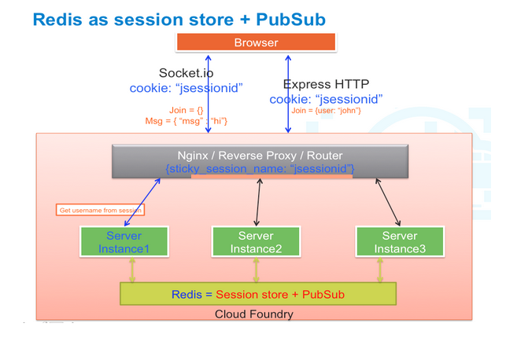
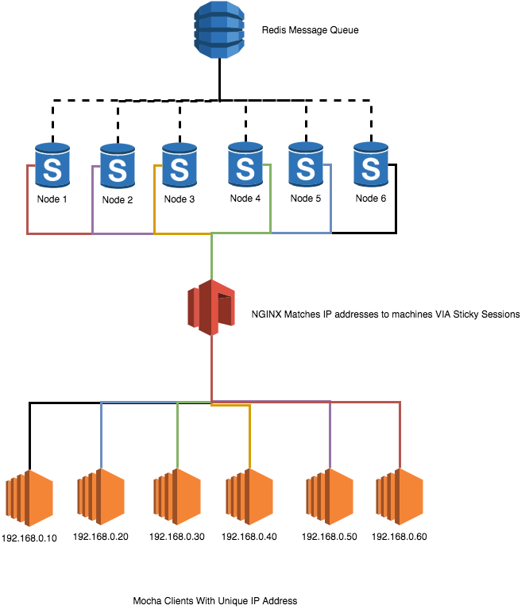
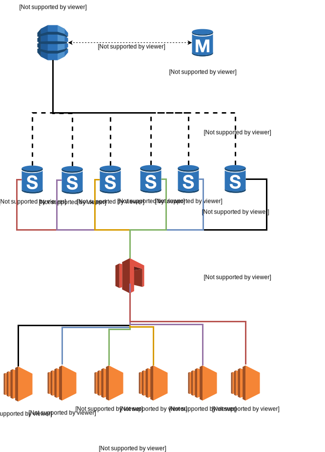
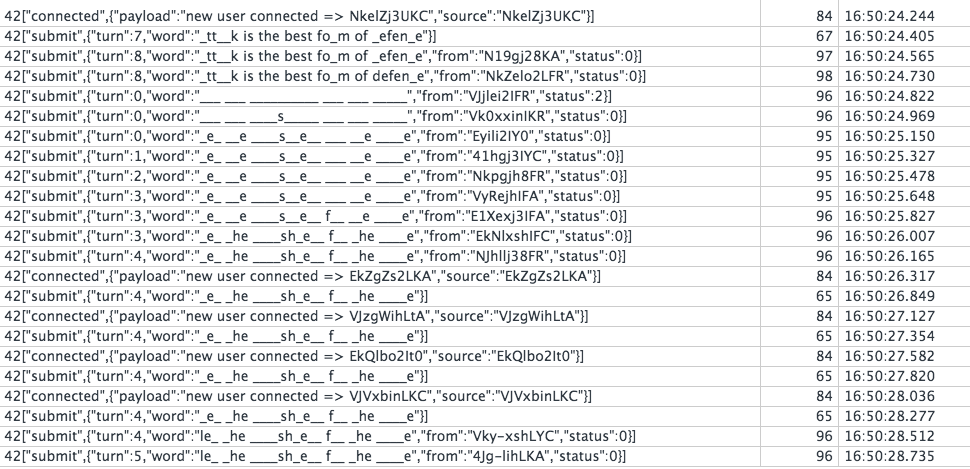
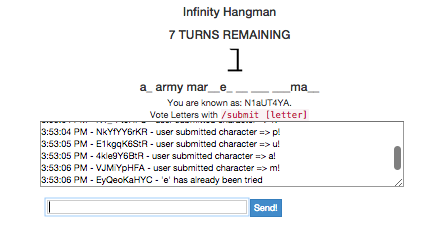
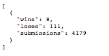

INFINITY HANGMAN
================

Uses [NGINX](https://www.nginx.com/resources/wiki/), [Redis](http://redis.io/), and [PM2](https://github.com/Unitech/pm2) to horizontally scale to handle a theoretically million simultaneous user game of hangman. Game only tested up to 60,000 simultaneous playing users. Mocha on the testing farm keeps running out of memory, server however does not have memory issues and should be able to scale fantastic.

###[Why Socket is way way fast than Restful HTTP](http://blog.arungupta.me/rest-vs-websocket-comparison-benchmarks/)

#Game Rules
* 10 trys for each game
* Users Can't submit same characte twice
* submit characters to game by using the `/submit ` command

#HOW TO USE SERVER THE EASYWAY
* turn on server
  * `npm install`
  * `SIMPLE=true node app.js`
* make sure to find your ip address, `localhost` will not work, run this command in terminal to find your ip address
  * `ifconfig en1 | grep 'inet ' | cut -d ' ' -f 2`
* navigate to your ip address and port 3000 in browser
  * `http://192.168.0.17:3000`
* view game statistics via API GET REQUEST at /api/gameStats
  * `http://192.168.0.17:3000/api/gameStats`
* run the tests using mocha
  * `mocha`

#Environment Variables

* `DISABLE_BROADCAST=0` disables slow broadcast messaging
* `SIMPLE` disables reddis for message queue and socket management
* `HOST` `SOCKET_HOST` sets the server IP addres, useful for testing
* `PORT` `SOCKET_PORT` sets the server PORT address, useful for testing
*  `REDIS_HOST` `REDIS_PORT` sets the redis HOST and PORT

# READ [MAC INSTRUCTIONS README.md](https://github.com/meticulo3366/infinite_hangman/blob/master/MAC_INSTRUCTIONS_README.md) to get started on deploying the server farm and private cloud or local dev

### [Original Angular Code base for Inspiration](https://github.com/krimple/angular-socketio-chat)

## Game Logic
* Frontend
  * [Angular Factory Interface](angular-frontend/app/scripts/services/hangmanUserCommuncations.js)
  * [Angular Hangman View](angular-frontend/app/scripts/controllers/hangman.js)
* Backend
  * [Socket Based Logic](sockets/base.js)
  * [Hangman Game Logic](gameLogic/gameLogic.js)
  * [Letter Polling System (Not Implemented)](gameLogic/gameLogic.js)
* Quality Assurance
  * [Load Testing Script](testing/test.js)
* DevOps
  * [Vagrant Deploys 6 Virtual Box Testing Machines](Vagrantfile)
  * [NGINX acts as load balancer with IP Hashing](nginx/nginx.conf)
  * [10 PM2 instances of server are deployed](launch10.sh)
  * [Script to Shutdown the 6 Virtual Machines](killTesters.sh)

## Architecture
* username is uniquely fingerprinted from the start
* DevOps Architecture for frontend + backend + clients as implemented (not using cloud foundary)

###Redis Diagram
   
   
###Client Networking Diagram
   

  
## Millions of User Scaling...
* usernames and IDs limited to 7 characters
* /commands limited to 7 characters
* user can only send 1 character at a time during the voting session
* [Heavy Inspiration](https://github.com/rajaraodv/rabbitpubsub)
* The ideal architecture is in the following diagram
* 

### Screens

### Game Screenshoot

### Game Statistics Example

## Server Farm Benchmarking Video

### Future Plans
[Look Into Using Hapi.js and Redis Messaging Queue](https://github.com/meticulo3366/hapi-socketio-redis-chat-example)